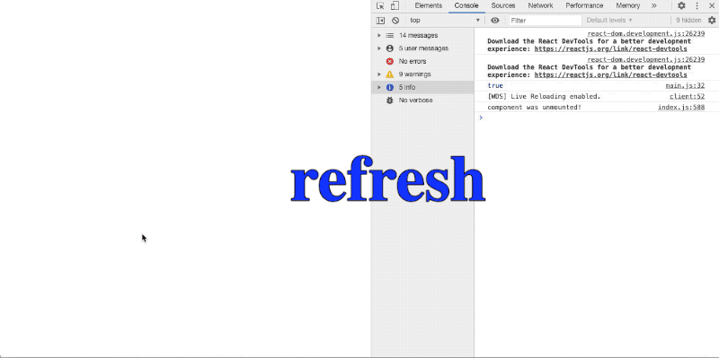

# antd-spin

[](https://www.npmjs.com/package/antd-spin)

[](https://github.com/condorheroblog/antd-spin/blob/main/LICENSE)
[](https://github.com/condorheroblog/antd-spin)

> Enhancing Ant Design's Spin as a Service. Inspired by [Element Plus](https://element-plus.org/en-US/component/loading.html)'s Loading component.

## Motivation

Enhance the `Spin` component of `antd` to support service calls, and the global state is a singleton mode.

## Usage


### Install

```bash
$ npm install antd-spin
```

### Service

Import Spin service:

```ts
import { antdSpin } from "antd-spin";
```

Invoke it:

```ts
antdSpin.service(options);
```

The parameter `options` is the configuration of Spin, and its details can be found in the following table. `SpinService` returns a Spin instance, and you can close it by invoking its `close` method:

```ts
const spinInstance = antdSpin.service(options);
spinInstance.close();
```

Note that in this case the full screen Spin is singleton. If a new full screen Spin is invoked before an existing one is closed, the existing full screen Spin instance will be returned instead of actually creating another Spin instance:


```ts
const spinInstance1 = antdSpin.service();
const spinInstance2 = antdSpin.service();

// true
console.log(spinInstance1 === spinInstance2);

setTimeout(() => {
	// Calling the `close` method on any one of them can close this full screen Spin.
	spinInstance2.close();
}, 5000);
```

show time



### Directive

```tsx
import { AntdSpin } from "antd-spin";

const DemoSpin = () => {
	return (
		<AntdSpin fullscreen={true} />
	);
}
```

- `fullscreen` is true, return a fullscreen Spin.
- `fullscreen` is false, return a Spin.

### Options

| Name        | Description                                                                                                                                                              | Type                       | Default       |
| ----------- | ------------------------------------------------------------------------------------------------------------------------------------------------------------------------ | -------------------------- | ------------- |
| target      | The DOM node Spin needs to cover. Accepts a DOM object or a string. If it's a string, it will be passed to `document.querySelector` to get the corresponding DOM node    | `string` / `HTMLElement`   | document.body |
| fullscreen  | Show a full screen Spin                                                                                                                                                  | `boolean`                  | true          |
| lock        | Disable background scrolling                                                                                                                                             | `boolean`                  | false         |
| background  | Background color of the mask                                                                                                                                             | `string`                   | —             |
| customClass | Custom class name for Spin                                                                                                                                               | `string`                   | —             |
| spinProps   | The properties of antd's Spin component                                                                                                                                  | [SpinProps](#spinprops)    | {}            |

#### [SpinProps](https://github.com/ant-design/ant-design/blob/master/components/spin/index.tsx#L17)

| Name            | Type                | Description                                                        |
| --------------- | ------------------- | -------------------------------------------------------------------|
| prefixCls       | string              | Prefix class name (optional)                                       |
| className       | string              | Class name (optional)                                              |
| rootClassName   | string              | Root element class name (optional)                                 |
| spinning        | boolean             | Whether to display the loading state                               |
| style           | React.CSSProperties | Custom style object (optional)                                     |
| size            | SpinSize            | Size (optional)                                                    |
| tip             | React.ReactNode     | Tip content (optional)                                             |
| delay           | number              | Time in milliseconds to delay showing the loading state (optional) |
| wrapperClassName| string              | Wrapper element class name (optional)                              |
| indicator       | SpinIndicator       | Custom loading indicator (optional)                                |
| children        | React.ReactNode     | Child elements (optional)                                          |
